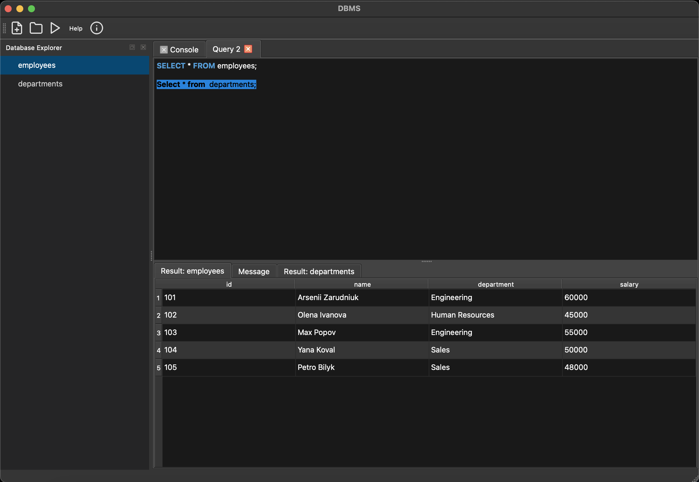

# Simple DBMS in C++ with Qt

This is an educational Database Management System (DBMS) project, built from scratch in C++. It features a custom SQL engine for backend logic and a graphical user interface (GUI) made with the Qt framework.

The main goal of this project is to understand how databases work "under the hood."

## Key Features

- **Custom SQL Engine:** Handles core SQL commands for defining, manipulating, and querying data.
- **Graphical User Interface:** A user-friendly desktop application with:
  - A dark theme.
  - A tabbed interface for writing multiple queries.
  - A database explorer to view tables.
  - SQL syntax highlighting and code completion.
- **Supported SQL Commands:**
  - `CREATE TABLE`, `DROP TABLE`
  - `INSERT INTO`
  - `SELECT` (with `FROM`, `WHERE`, `GROUP BY`, `HAVING`, and `COUNT` aggregation)
  - `UPDATE`
  - `DELETE`
- **File-Based Storage:** The database is saved as plain text files, making it easy to inspect and manage.

## Screenshot



## Prerequisites

- **C++ Compiler:** A compiler supporting C++20 (e.g., GCC, Clang, MSVC).
- **Qt Framework:** Version 6 or higher.
- **CMake:** For building the project.
- **fmtlib:** For string formatting.
- **Googletest:** For running unit tests.

## Installation & Running

1.  Clone the repository:
    ```bash
    git clone https://github.com/arseniizar/DBMS-cpp.git
    cd DBMS-cpp
    ```
2.  Build the project using CMake and your preferred C++ compiler. Most IDEs like CLion or Qt Creator can open the `CMakeLists.txt` file directly.
3.  Run the compiled application.
