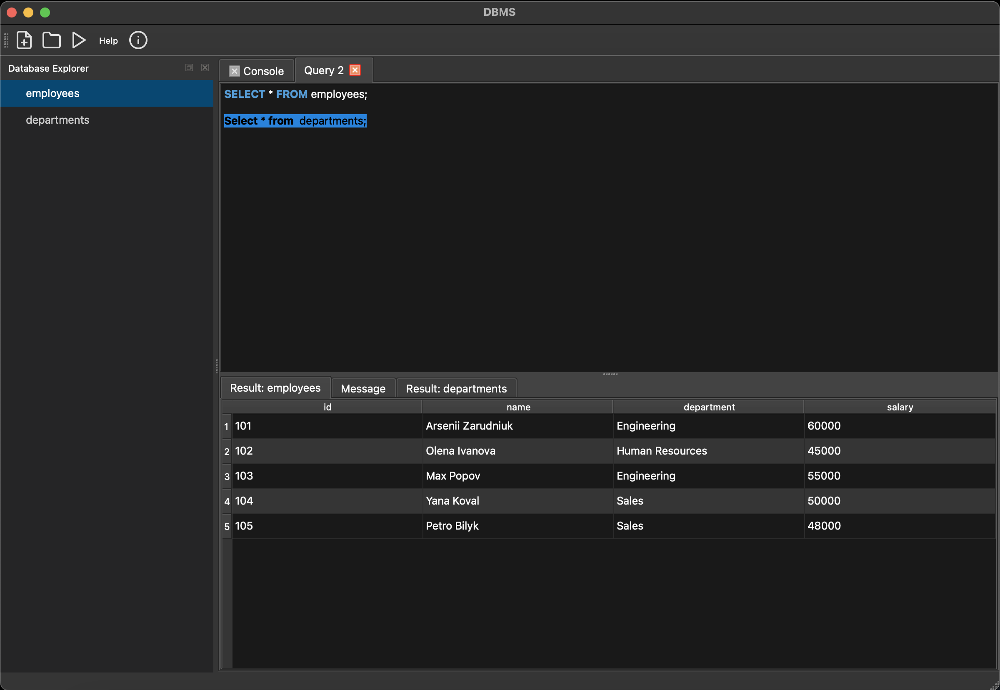

# Relational DBMS & SQL Execution Engine


An educational Relational Database Management System (RDBMS) built from scratch in modern **C++20** with an interactive desktop GUI powered by **Qt 6**. 

The goal of this project is to explore database internals "under the hood": query tokenization, finite-state machine (FSM) syntax parsing, relational query execution planning, and disk snapshot persistence.

---

## Architecture Overview

The system is decoupled into modular layers:

- **Input:** SQL Query string
- **Lexer & Parser:** Finite-State Machine (FSM) tokenizer and parser validating grammar rules and syntax tokens
- **Query Representation:** Structured intermediate representation (`Query` command object) representing DDL, DML, or DQL commands
- **Execution Engine:** Evaluates relational queries, performing multi-condition filtering (`WHERE`), table joins (`JOIN`), and aggregations
- **Storage Layer:** File-based table snapshot persistence and schema type management (`INTEGER`, `NVARCHAR2`, `DATE`)
- **Desktop UI:** Qt 6 graphical interface featuring `QSyntaxHighlighter`, query tabs, and table grid visualization via `QAbstractTableModel`

---

## Key Features

- **Custom SQL Engine:**
  - **DDL:** `CREATE TABLE` (with `PRIMARY KEY`, `FOREIGN KEY`, `REFERENCES`), `DROP TABLE`.
  - **DML:** `INSERT INTO`, `UPDATE`, `DELETE`.
  - **DQL:** `SELECT ... FROM ... WHERE` with multi-conditional filtering (`AND`, comparison operators).
  - **Aggregations & Grouping:** `GROUP BY`, `HAVING`, and `COUNT(...)`.
  - **Relationships:** Basic `JOIN` evaluation between tables.
- **Desktop Database Explorer (Qt 6):**
  - Custom code editor with real-time SQL syntax highlighting (`QSyntaxHighlighter`).
  - Tabular data visualization implemented via `QAbstractTableModel`.
  - Tabbed query workspace and interactive schema explorer.
- **Robust Verification:**
  - Automated unit and integration test suite using **GoogleTest** covering parser state transitions, edge-case query parsing, and execution results.

---

## Screenshot



---

## Tech Stack & Prerequisites

- **Language:** C++20 (GCC 11+, Clang 13+, or MSVC 2019+)
- **GUI Framework:** Qt 6.x (Core, Gui, Widgets)
- **Build System:** CMake 3.20+
- **Third-Party Libraries:**
  - `fmtlib` for modern string formatting
  - `googletest` for test automation

---

## Building and Running

### 1. Clone the repository
```bash
git clone https://github.com/arseniizar/DBMS-cpp.git
cd DBMS-cpp
